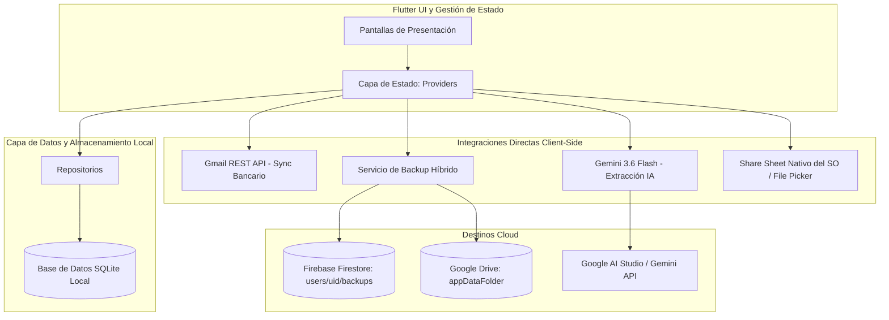

# Finance Tracker — Resumen Completo y Especificación Técnica de la Aplicación

## 1. Resumen Ejecutivo y Filosofía de Arquitectura

**Finance Tracker** es una aplicación multiplataforma de finanzas personales desarrollada en Flutter bajo la filosofía **Local-First**. Proporciona gestión patrimonial integral, contabilidad multimoneda, control inteligente de suscripciones, metas de ahorro predictivas, sincronización bancaria automática con Inteligencia Artificial on-device y copias de seguridad duales en la nube sin ningún costo de infraestructura de servidores ($0.00).

### Pilares Fundamentales
1. **Local-First y Privacidad Absoluta:** Todos los datos financieros se almacenan en el dispositivo en una base de datos local SQLite (`finance_tracker.db`). El usuario tiene el control y soberanía total sobre su información.
2. **Cero Costo de Servidor ($0.00):** Utiliza OAuth2 del lado del cliente para comunicarse directamente con la API de Google Drive v3 (`appDataFolder`), Firebase Firestore (Plan Spark gratuito), Gmail REST API y Gemini AI sin necesidad de servidores intermedios ni costos mensuales.
3. **Contabilidad Multimoneda Real (Precisión Entera Zero-Float):** Todos los valores monetarios se representan internamente en centavos enteros para eliminar errores de redondeo de punto flotante, con soporte para tasas de cambio en vivo y ajustes manuales.
4. **Ingestión Bancaria Autónoma con IA:** Emplea el modelo `gemini-3.6-flash` mediante llamadas REST directas para extraer información estructurada de correos de alertas bancarias, evitando duplicados mediante etiquetado inteligente en Gmail.
5. **Copia de Seguridad Dual Criptográfica:** Firmas SHA-256 garantizan la integridad de los datos en respaldos simultáneos a Firebase Firestore y Google Drive con restauración atómica en un solo toque.

---

## 2. Especificación Detallada Pantalla por Pantalla

### 2.1. Panel Principal: Dashboard (`DashboardScreen`)
El centro de mando financiero que proporciona visibilidad en tiempo real del patrimonio neto, flujo de caja mensual, distribución de gastos y movimientos recientes.

* **Tarjeta de Patrimonio Neto (`HeroNetWorthCard`):**
  * Muestra el **Patrimonio Neto Consolidado** (`Total Activos - Total Pasivos`).
  * Desglose en tiempo real de **Activos** (cuentas bancarias, billeteras digitales, efectivo, inversiones) y **Pasivos** (saldo deudor en tarjetas de crédito).
* **Métricas de Flujo de Caja Mensual:**
  * Calcula automáticamente el **Total de Ingresos**, **Total de Gastos** y el **Ahorro Neto** del período actual.
* **Gráfico Interactivo de Gastos por Categoría (`CategoryExpensePieChart`):**
  * Representa la distribución porcentual de los gastos en un gráfico de pastel.
  * La selección táctil resalta el segmento y muestra el monto exacto gastado.
* **Botones de Acción Rápida:**
  * Accesos directos modales para *Nuevo Gasto/Ingreso*, *Transferencia entre Cuentas*, *Sincronización Bancaria con IA* y *Crear Cuenta*.
* **Feed de Transacciones Recientes:**
  * Lista cronológica de los últimos movimientos con acceso directo a los detalles de cada transacción.
* **Sincronización Automática en Primer Plano:**
  * Comprueba si hay nuevos correos bancarios al abrir la aplicación o al regresar desde segundo plano (`AppLifecycleState.resumed`).

---

### 2.2. Gestión de Cuentas y Tarjetas de Crédito (`AccountsScreen`)
Administración completa de instrumentos financieros, saldos, límites de crédito y conciliación.

* **Agrupación por Tipo de Cuenta:**
  * **Cuentas Bancarias:** Cuentas de ahorros y corrientes (ej: Bancolombia, Davivienda).
  * **Billeteras Digitales:** Cuentas de pago rápido (Nequi, Daviplata, Dale).
  * **Efectivo:** Dinero físico disponible.
  * **Tarjetas de Crédito:** Instrumentos de crédito rotativo (Nu, RappiCard).
  * **Inversiones y Ahorros Bloqueados:** Fondos a plazo o inversiones.
* **Motor de Utilización de Tarjetas de Crédito:**
  * Monitorea el **Cupo Total**, **Deuda Actual**, **Cupo Disponible** y el **Porcentaje de Utilización del Crédito**.
* **Creación y Personalización de Cuentas (`AddEditAccountScreen`):**
  * Configuración de nombre, tipo de cuenta, saldo inicial, moneda base de la cuenta, color e icono temático.
* **Ajuste Rápido de Saldo:**
  * Permite conciliar o corregir el saldo directamente sin crear transacciones manuales ficticias.
* **Archivado de Cuentas:**
  * Oculta cuentas inactivas o cerradas sin comprometer la integridad de los reportes históricos.

---

### 2.3. Transacciones y Calculadora Rápida (`TransactionListScreen` y `QuickTransactionScreen`)
Diseñado para registrar gastos e ingresos a máxima velocidad y auditar el historial de movimientos.

* **Teclado Numérico con Calculadora Integrada (`CalculatorNumpad`):**
  * Soporta operaciones matemáticas en vivo (`+`, `-`, `*`, `/`) en el campo del monto (ej: `25000 + 4500`).
* **Tipos de Movimientos:**
  * **Gasto (Expense):** Deduce saldo de cuentas de activo o incrementa la deuda en tarjetas de crédito.
  * **Ingreso (Income):** Aumenta el saldo en la cuenta receptora.
  * **Transferencia (Transfer):** Mueve fondos atómicamente entre dos cuentas propias (ej: transferir de Bancolombia a Nequi, o pagar la tarjeta de crédito desde la cuenta de ahorros).
* **Tarjeta de Conversión Multimoneda (`CurrencyConversionCard`):**
  * Permite registrar transacciones en moneda extranjera (ej: compra en USD debitada a una cuenta en COP).
  * Obtiene la tasa de cambio en vivo desde `open.er-api.com` con soporte para tasa personalizada manual.
* **Búsqueda y Filtros Multidimensionales:**
  * Búsqueda por texto en descripciones.
  * Filtros por rango de fecha (Hoy, Este Mes, Rangos Personalizados).
  * Filtros por Cuenta, Categoría y Tipo de Transacción.
* **Vista de Detalle (`TransactionDetailScreen`):**
  * Muestra fecha exacta, hora, cuentas involucradas, conversión multimoneda, categoría y notas, con edición y eliminación con reversión automática de saldos.

---

### 2.4. Suscripciones y Pagos Recurrentes (`SubscriptionsScreen`)
Control preventivo de gastos fijos y automatización de cobros recurrentes.

* **Tasa de Quema y Proyecciones:**
  * Calcula el **Gasto Mensual Total en Suscripciones** y la proyección de costo anual.
* **Ciclos de Cobro Flexibles:**
  * Soporta frecuencias **Semanal**, **Quincenal**, **Mensual** y **Anual** con cálculo automático del siguiente vencimiento.
* **Pago con 1 Toque:**
  * La acción "Pagar" genera la transacción de gasto real en la cuenta seleccionada y adelanta la fecha del próximo cobro automáticamente.
* **Auto-Registro Inteligente:**
  * Opción para que la app contabilice automáticamente el gasto al cumplirse el día de cobro.
* **Emparejamiento Automático con IA:**
  * Al ingresar correos bancarios, si el cargo coincide con una suscripción activa ($\pm 15\%$ de tolerancia de precio y $\pm 4$ días de margen), se vincula directamente y se actualiza el ciclo.

---

### 2.5. Presupuestos y Metas de Ahorro (`BudgetsScreen` y `SavingsGoalsScreen`)
Planificación financiera por categorías y seguimiento de metas personales.

#### A. Presupuestos por Categoría:
* **Topes de Gasto Mensuales:** Asigna un límite máximo a cada categoría para cualquier mes.
* **Semáforo Visual de Estado:**
  * 🟢 **Seguro:** Gasto inferior al 80% del límite.
  * 🟡 **Alerta:** Gasto entre el 80% y el 99% del límite.
  * 🔴 **Excedido:** Gasto al 100% o superior, mostrando el valor exacto excedido.
* **Navegación Histórica:** Consulta y compara la ejecución de presupuestos de meses pasados y futuros.

#### B. Metas de Ahorro:
* **Definición de Metas:** Nombre, monto objetivo en centavos, fecha límite deseada, icono y color.
* **Calculadora de Ahorro Mensual Requerido:** Calcula automáticamente cuánto dinero debes ahorrar cada mes para alcanzar el objetivo a tiempo.
* **Depósito Directo:** Transfiere dinero directamente desde cualquier cuenta activa hacia la meta de ahorro con un solo toque.

---

### 2.6. Analíticas y Reportes Visuales (`AnalyticsScreen`)
Visualización gráfica de hábitos financieros y tendencias a lo largo del tiempo.

* **Selector de Período:** Mes Actual, Últimos 3 Meses, Últimos 6 Meses, Año Actual.
* **Comparativas Mes contra Mes:** Variación porcentual de incremento o reducción del gasto respecto al ciclo anterior.
* **Gráfico de Barras de Flujo de Caja:** Comparativa visual de Ingresos vs Gastos mes a mes.
* **Ranking de Categorías:** Lista ordenada de mayor a menor gasto con importes exactos y porcentajes del total.

---

### 2.7. Sincronización Bancaria con IA desde Gmail (`GmailSyncSettingsScreen`)
Ingestión directa y privada de notificaciones bancarias mediante OAuth2 y Google Gemini.

* **OAuth2 Directo sin Backend:**
  * Solicita permisos granulares (`gmail.readonly`, `gmail.modify`, `gmail.labels`) directamente desde el dispositivo.
* **Extracción con Gemini 3.6 Flash:**
  * Envía el contenido del correo a Gemini con esquemas JSON estrictos para extraer monto, moneda, comercio, fecha, máscara de cuenta y tipo de movimiento.
* **Etiquetado `FinanceTracker/Processed` en Gmail:**
  * Marca los correos procesados para evitar lecturas duplicadas y mantener estricta idempotencia.
* **Soporte para Bancos Colombianos:**
  * Configurado para Bancolombia, Nu Colombia, RappiCard, Davivienda y remitentes personalizados.
* **Normalización Horaria de Colombia (UTC-5):**
  * Aplica el offset `-05:00` para garantizar que las fechas coincidan exactamente con la hora local de la transacción.

---

### 2.8. Backup Dual en la Nube y Exportación de Archivos (`BackupSettingsScreen`)
Respaldo en la nube con redundancia dual y exportación nativa de archivos.

* **Backup Dual Simultáneo (Firebase Firestore + Google Drive):**
  * Sube snapshots encriptados a **Cloud Firestore** (`users/{uid}/backups/{id}`) y a la carpeta privada **Google Drive** (`appDataFolder`).
  * Tolerancia a fallos: Si uno de los proveedores falla o no está autenticado, el otro continúa y se guarda exitosamente.
* **Respaldo Total de Datos y Configuración:**
  * Incluye cuentas, categorías, transacciones, suscripciones, presupuestos, metas de ahorro, tasas de cambio en caché y todas las preferencias (`app_settings`: moneda por defecto, idioma, API keys, remitentes y switches de sincronización).
* **Verificación Criptográfica SHA-256:**
  * Cada copia de seguridad incluye una firma hash SHA-256. Archivos alterados o incompletos son rechazados antes de restaurar.
* **Restauración Atómica SQLite:**
  * Restaura todo el estado en una única transacción SQLite (`db.transaction`), refrescando al instante la interfaz, monedas e idioma.
* **Exportar y Compartir CSV (Excel):**
  * Genera el archivo físico `.csv` bajo estándar RFC 4180 y abre el menú nativo para compartir en WhatsApp, Gmail, Descargas o abrir directamente en Microsoft Excel.
* **Exportar y Restaurar Archivo Local JSON:**
  * Comparte snapshots en formato `.json` o importa archivos de respaldo locales con el selector de archivos nativo (`file_picker`).

---

### 2.9. Ajustes Generales (`SettingsScreen`)
Configuración global y preferencias de la aplicación.

* **Selector de Moneda Principal:** Permite elegir la divisa base (`COP`, `USD`, `EUR`, etc.) con formateo inteligente de decimales (sin decimales para COP, 2 decimales para USD).
* **Selector de Idioma:** Español (`es`), Inglés (`en`) o Automático según el sistema operativo.
* **Accesos Rápidos:** Enlaces directos a la sincronización de Gmail y a la gestión de copias de seguridad.

---

## 3. Arquitectura de Base de Datos (Esquema SQLite)

| Tabla | Clave Primaria | Descripción |
| :--- | :--- | :--- |
| `accounts` | `id` (TEXT) | Cuentas financieras, saldos, límites de crédito, monedas, iconos, colores y estado archivado. |
| `categories` | `id` (TEXT) | Categorías de gasto e ingreso, iconos, colores y banderas de categorías por defecto. |
| `transactions` | `id` (TEXT) | Movimientos contables, montos en centavos, multimoneda, tasas de cambio y cuentas asociadas. |
| `subscriptions` | `id` (TEXT) | Pagos recurrentes, frecuencias de cobro, próximas fechas de vencimiento y auto-registro. |
| `budgets` | `id` (TEXT) | Límites mensuales de gasto por categoría con claves de mes y año. |
| `savings_goals` | `id` (TEXT) | Montos objetivo, montos ahorrados, fechas límite y estado de completitud. |
| `app_settings` | `key` (TEXT) | Preferencias del usuario (moneda, idioma, API keys, remitentes monitoreados y switches). |
| `exchange_rates` | `(base_currency, target_currency)` | Tasas de cambio en vivo almacenadas en caché con marcas de tiempo ISO. |

---

## 4. Métricas de Calidad y Verificación

* **Análisis Estático:** `flutter analyze` pasa con **0 advertencias y 0 errores**.
* **Suite de Pruebas Automatizadas:** **208 / 208 pruebas unitarias y de widgets aprobadas al 100%**.
* **Gobernanza:** 21 tareas y 5 especificaciones técnicas validadas sin observaciones mediante Vector MCP.
* **Compilación de Producción:** APK de lanzamiento (`app-release.apk` de 25.2 MB) validado en dispositivos físicos Android.
