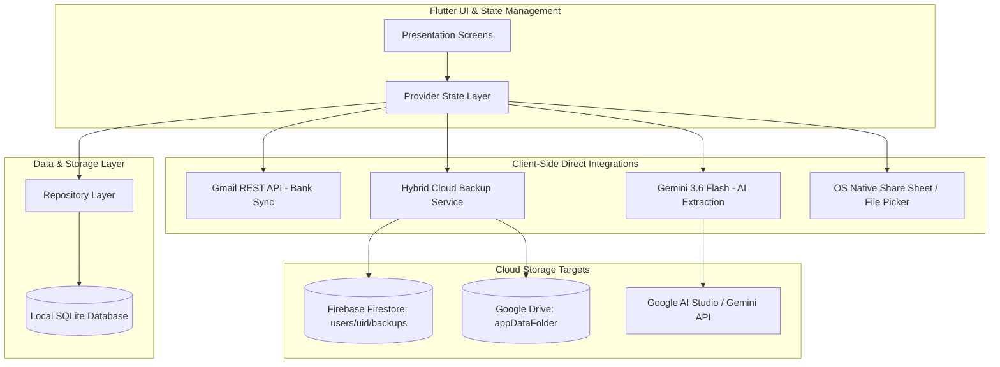

# Finance Tracker — Complete Application Overview & Technical Specification

## 1. Executive Summary & Architecture Philosophy

**Finance Tracker** is a cross-platform, local-first personal finance application built with Flutter. It delivers full wealth management, multi-currency accounting, smart subscription tracking, predictive savings goals, automated bank email ingestion with on-device AI, and dual-destination cloud backup with zero server infrastructure cost ($0.00).

### Core Pillars
1. **Local-First & Privacy-Centric:** All financial data is persisted on-device in a local SQLite database (`finance_tracker.db`). The user retains complete data sovereignty.
2. **Zero-Backend Cloud Integration ($0.00 Operating Cost):** Leverages client-side OAuth2 to communicate directly with Google Drive API v3 (`appDataFolder`), Firebase Firestore (Spark Plan), Gmail REST API, and Gemini AI without intermediate hosted servers.
3. **True Multi-Currency Accounting (Zero-Float Precision):** All monetary values are strictly represented and calculated in integer cents to prevent floating-point rounding errors, supporting live exchange rates and manual overrides.
4. **Autonomous Client-Side Bank Ingestion:** Employs `gemini-3.6-flash` via direct REST APIs to extract structured transaction data from bank notification emails with duplicate prevention and subscription reconciliation.
5. **Cryptographically Verified Dual Cloud Backup:** SHA-256 checksums ensure tamper-proof snapshot backups to Firebase Firestore and Google Drive with single-tap atomic restorations.

---

## 2. Comprehensive Screen & Feature Specification

### 2.1. Dashboard (`DashboardScreen`)
The central financial command center providing real-time visibility into net worth, monthly cash flow, category distributions, and recent movements.

* **Hero Net Worth Card (`HeroNetWorthCard`):**
  * Displays consolidated **Net Worth** (`Total Assets - Total Liabilities`).
  * Real-time breakdown of **Total Assets** (bank accounts, digital wallets, cash, investments) and **Total Liabilities** (active credit card balances).
* **Monthly Cash Flow Metrics:**
  * Computes dynamic **Total Income**, **Total Expenses**, and **Net Monthly Savings** for the active calendar period.
* **Interactive Category Expense Pie Chart (`CategoryExpensePieChart`):**
  * Renders percentage-based expense distribution across all categories.
  * Interactive touch selection highlights specific segments and displays exact amounts.
* **Quick Action Buttons:**
  * Instant modal navigation for *New Expense/Income*, *Transfer between Accounts*, *Bank Email Synchronization*, and *New Account Creation*.
* **Recent Activity Feed:**
  * Chronological list of the latest transactions with direct detail navigation.
* **Autonomous Foreground Sync:**
  * Checks for new bank notification emails on app initialization and `AppLifecycleState.resumed` events.

---

### 2.2. Accounts & Credit Cards (`AccountsScreen`)
Full management of financial accounts, balances, credit limits, and historical reconciliation.

* **Account Categorization & Grouping:**
  * **Bank Accounts:** Checking and savings accounts (e.g., Bancolombia, Davivienda).
  * **Digital Wallets:** Fast-payment accounts (Nequi, Daviplata, Dale).
  * **Cash:** Physical cash holdings.
  * **Credit Cards:** Revolving credit instruments (Nu, RappiCard).
  * **Investments & Locked Savings:** Long-term assets.
* **Credit Card Utilization Engine:**
  * Tracks **Total Credit Limit**, **Current Debt Balance**, **Remaining Available Credit**, and **Credit Utilization Rate (%)**.
* **Account Creation & Customization (`AddEditAccountScreen`):**
  * Configure account name, account type, opening balance, account base currency, hex color theme, and iconography.
* **Direct Balance Reconciliation:**
  * Allows manual balance corrections without creating artificial adjustment transactions.
* **Account Archival:**
  * Soft-archive inactive accounts to hide them from daily selectors while preserving historical transaction integrity.

---

### 2.3. Transactions & Fast Calculator (`TransactionListScreen` & `QuickTransactionScreen`)
Designed for lightning-fast transaction logging and deep ledger auditing.

* **High-Speed Numerical Keypad (`CalculatorNumpad`):**
  * Integrated on-screen calculator keypad supporting arithmetic operations (`+`, `-`, `*`, `/`) directly within the amount field.
* **Transaction Types:**
  * **Expense:** Deducts balance from asset accounts or increases credit card liability.
  * **Income:** Increments balance on the designated receiving account.
  * **Transfer:** Atomically transfers funds between two distinct accounts (e.g., Bank to Digital Wallet, or Bank to Credit Card debt payoff).
* **Multi-Currency Conversion Card (`CurrencyConversionCard`):**
  * Enables logging transactions in foreign currencies (e.g., purchasing in USD on a COP account).
  * Automatically fetches live exchange rates from `open.er-api.com` with support for manual rate overrides.
* **Search & Multidimensional Filtering:**
  * Full-text description search.
  * Date range filtering (Today, This Month, Custom Ranges).
  * Multi-select filters by Account, Category, and Transaction Type.
* **Transaction Detail View (`TransactionDetailScreen`):**
  * Shows exact timestamp, source/target accounts, multi-currency conversion chips, category badges, and notes, with atomic edit/delete and balance reversal.

---

### 2.4. Subscriptions & Fixed Expenses (`SubscriptionsScreen`)
Proactive tracking and automation for recurring bills and subscriptions.

* **Burn Rate & Projection Metrics:**
  * Computes normalized **Monthly Burn Rate** and projected **Annual Cost** across all active subscriptions.
* **Flexible Billing Frequencies:**
  * Supports **Weekly**, **Bi-weekly**, **Monthly**, and **Annual** billing intervals with automatic next-due-date calculation.
* **Single-Tap Payment Execution:**
  * "Pay Now" action automatically posts a real expense transaction to the designated account and advances the next due date to the subsequent billing cycle.
* **Automated Due-Date Processing:**
  * Configurable auto-register flag to automatically book expenses on the exact billing day.
* **Intelligent AI Reconciliation:**
  * When bank emails are ingested via Gemini, transactions matching an active subscription within $\pm 15\%$ amount tolerance and $\pm 4$ days billing window are automatically linked, advancing the subscription cycle.

---

### 2.5. Budgets & Savings Goals (`BudgetsScreen` & `SavingsGoalsScreen`)
Targeted financial planning, spending caps, and savings discipline.

#### A. Category Budgets:
* **Monthly Spending Caps:** Set specific spending limits per expense category for any calendar month.
* **Visual Status Indicators:**
  * 🟢 **Safe:** Spending below 80% of limit.
  * 🟡 **Warning:** Spending between 80% and 99% of limit.
  * 🔴 **Exceeded:** Spending at or exceeding 100% of limit with explicit overage calculations.
* **Historical Period Navigation:** Inspect and compare past budget performance month-by-month.

#### B. Savings Goals:
* **Goal Definition:** Set target name, target amount in cents, target completion date, icon, and color.
* **Required Monthly Savings Calculator:** Automatically calculates the exact monthly deposit needed to reach the goal by the target date.
* **Direct Deposit Action:** Transfer funds directly from any active bank/cash account into the savings goal.

---

### 2.6. Visual Analytics & Reports (`AnalyticsScreen`)
Comprehensive analytical graphs and period-over-period financial comparisons.

* **Timeframe Selector:** Current Month, Last 3 Months, Last 6 Months, Year-to-Date.
* **Month-over-Month Variance:** Tracks percentage increase or decrease in spending relative to prior cycles.
* **Historical Cash Flow Bar Chart:** Monthly visual comparison of total Income vs. total Expenses.
* **Category Breakdown:** Ranked list of categories with exact spend and proportion of overall expenses.

---

### 2.7. Client-Side AI Gmail Bank Ingestion (`GmailSyncSettingsScreen`)
Direct bank notification email ingestion using client-side OAuth2 and Google Gemini AI.

* **Zero-Backend Direct Gmail OAuth2:**
  * Requests granular Google scopes (`gmail.readonly`, `gmail.modify`, `gmail.labels`) directly from the device.
* **Structured Extraction with Gemini 3.6 Flash:**
  * Prompts Gemini with strict JSON schemas to extract amount, currency, merchant, date, account mask, and transaction type.
* **Idempotent Labeling (`FinanceTracker/Processed`):**
  * Modifies processed emails with a custom label to prevent duplicate parsing and maintain strict idempotency.
* **Colombian Bank Ecosystem Support:**
  * Pre-configured for Bancolombia, Nu Colombia, RappiCard, Davivienda, and custom sender addresses.
* **Colombia Timezone Enforcement (UTC-5):**
  * Normalizes email extraction timestamps to `-05:00` offset to avoid date skew.

---

### 2.8. Hybrid Cloud Backup & Native File Export (`BackupSettingsScreen`)
Dual cloud backup and native device file sharing with cryptographic verification.

* **Dual Cloud Backup (Firebase Firestore + Google Drive):**
  * Simultaneously uploads encrypted SQLite database snapshots to **Cloud Firestore** (`users/{uid}/backups/{id}`) and **Google Drive** (`appDataFolder`).
  * Isolated fault tolerance: If one destination fails or is unauthenticated, the other still succeeds.
* **Full Configuration & Preferences Snapshot:**
  * Backs up accounts, categories, transactions, subscriptions, budgets, savings goals, cached exchange rates, and user preferences (`app_settings`: default currency, language/locale, API keys, monitored senders, auto-sync toggles).
* **Cryptographic SHA-256 Integrity Verification:**
  * Every backup snapshot includes a SHA-256 checksum generated from canonical JSON. Corrupted or altered files are rejected before restoration.
* **Atomic Database Restoration:**
  * Restores state inside a SQLite transaction (`db.transaction`), re-enabling foreign keys and immediately reloading `SettingsProvider`, `AccountsProvider`, `TransactionsProvider`, and `BudgetsProvider`.
* **Native CSV / Excel Export & Share:**
  * Writes physical `.csv` ledger files conforming to RFC 4180 to cache and opens the native OS Share Sheet for WhatsApp, Gmail, Downloads, or Microsoft Excel.
* **Local JSON Export & File Picker Restore:**
  * Shares `.json` snapshots or imports `.json` backups from device storage via `file_picker`.

---

### 2.9. Application Settings (`SettingsScreen`)
Global preferences and system configuration.

* **Default Currency Selector:** Choose primary currency (`COP`, `USD`, `EUR`, etc.) with intelligent decimal formatting (0 decimals for COP, 2 decimals for USD).
* **Locale / Language Selector:** Switch between Spanish (`es`), English (`en`), or System Default.
* **Direct Navigation:** Quick access to Gmail Bank Synchronization and Cloud Backup screens.

---

## 3. Database Architecture (SQLite Schema)

| Table Name | Primary Key | Description |
| :--- | :--- | :--- |
| `accounts` | `id` (TEXT) | Financial accounts, balances, credit limits, currencies, icons, colors, archived status. |
| `categories` | `id` (TEXT) | Expense and Income categories, iconography, color coding, default seed flags. |
| `transactions` | `id` (TEXT) | Ledger movements, amounts in cents, multi-currency values, exchange rates, account relationships. |
| `subscriptions` | `id` (TEXT) | Recurring payments, billing intervals, next due dates, linked accounts, auto-register flags. |
| `budgets` | `id` (TEXT) | Monthly category limits, month/year keys, foreign key to categories. |
| `savings_goals` | `id` (TEXT) | Target amounts, saved amounts, target dates, completion status. |
| `app_settings` | `key` (TEXT) | User preferences (currency, language, Gemini API key, monitored senders, auto-sync). |
| `exchange_rates` | `(base_currency, target_currency)` | Cached live currency conversion rates with ISO timestamps. |

---

## 4. Verification & Quality Gates

* **Static Analysis:** `flutter analyze` passes with **0 warnings and 0 errors**.
* **Automated Test Suite:** **208 / 208 unit and widget tests passing (100% pass rate)**.
* **Governance Compliance:** All specifications (`spec-00001` through `spec-00005`) and tasks (`task-00001` through `task-00021`) fully validated via Vector MCP.
* **Production Build:** Release APK (`app-release.apk`) compiled and verified on physical Android devices.
