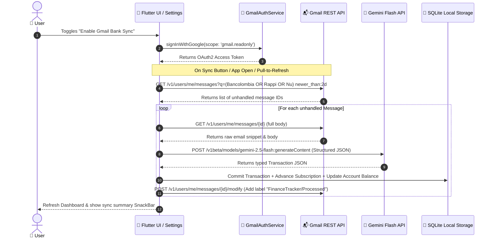

# SPEC 00004: Client-Side Gmail OAuth Bank Transaction Sync

## 1. Purpose

This specification defines the architecture, data contracts, and component interfaces for **direct client-side automated bank email ingestion** in the **Finance Tracker** Flutter application.

By transitioning from an external Google Apps Script intermediary to direct in-app OAuth2 integration:
- Users connect their Gmail with a single in-app tap via Google Sign-In.
- The Flutter client queries the Gmail REST API directly using on-device OAuth2 tokens.
- Transaction parsing is performed on-device via direct calls to Gemini 3.6 / 2.5 Flash API with structured JSON output.
- All extracted transactions are persisted directly into SQLite with atomic account updates, multi-factor subscription detection, and persistent Gmail labeling for idempotency.
- Operates strictly under the **$0.00 zero-server-cost** model with no external backend server dependencies.
- Retains unified Google Authentication and Firebase Core foundations to support multi-provider Cloud Backups (Google Drive and Firebase Firestore/Storage).

---

## 2. Architecture & System Flow



---

## 3. Component Contracts

### 3.1 `GmailAuthService` Interface

Responsible for managing Google Sign-In, scope authorization, and access token retrieval.

```dart
abstract class GmailAuthService {
  /// Stream emitting the currently signed-in Google account or null.
  Stream<GoogleSignInAccount?> get authStateChanges;

  /// Current signed-in user or null.
  GoogleSignInAccount? get currentUser;

  /// Initiates interactive Google Sign-In requesting Gmail read/modify scopes.
  Future<GoogleSignInAccount?> signIn();

  /// Attempts silent Google Sign-In to restore existing session without UI prompts.
  Future<GoogleSignInAccount?> signInSilently();

  /// Obtains valid OAuth2 authentication headers (including Bearer token).
  Future<Map<String, String>> getAuthHeaders();

  /// Signs out and revokes access tokens locally.
  Future<void> signOut();

  /// Checks if the user has granted Gmail permissions.
  Future<bool> isAuthorized();
}
```

**Required OAuth2 Scopes:**
- `https://www.googleapis.com/auth/gmail.readonly` (Read bank notification emails)
- `https://www.googleapis.com/auth/gmail.labels` (Create and apply `FinanceTracker/Processed` label)
- `https://www.googleapis.com/auth/gmail.modify` (Apply processed labels to avoid re-reading)
- `https://www.googleapis.com/auth/drive.appdata` (Google Drive backup scope)

**Google Cloud Console & Firebase Setup Requirements:**
1. **Firebase Authentication:** Google Sign-in provider enabled in Firebase Console (generates linked Web Client ID type 3).
2. **Android OAuth Credential:** Debug and Release SHA-1 / SHA-256 certificate fingerprints registered under package `com.example.financetracker.finance_tracker` in Firebase Console / Google Cloud Console.
3. **APIs Enabled:** `Gmail API` and `Google Drive API` enabled under the GCP project.
4. **OAuth Consent Screen:** User Type configured (External / Testing mode) with active tester accounts added under Test Users.

---

### 3.2 Monitored Bank Senders

The ingestion pipeline filters incoming emails matching default bank notification senders:
- **Bancolombia:** `alertasynotificaciones@bancolombia.com.co`, `alertasynotificaciones@an.notificacionesbancolombia.com`, `alertas@notificacionesbancolombia.com`
- **RappiCard:** `notificaciones@rappicard.co`, `noreply@rappicard.co`
- **Nu Colombia:** `nu@nu.com.co`, `tucuentanu@nu.com.co`, `ayuda@nu.com.co`, `notificaciones@nu.com.co`, `alertas@nu.com.co`

---

### 3.3 `GmailRemoteDataSource` Interface

Encapsulates direct HTTP communication with `https://gmail.googleapis.com/gmail/v1/users/me/`.

```dart
abstract class GmailRemoteDataSource {
  /// Fetches unhandled bank email headers matching configured query filters.
  Future<List<GmailMessageSummary>> fetchUnprocessedBankMessages({
    required Map<String, String> authHeaders,
    int maxResults = 25,
  });

  /// Fetches full message content by message ID.
  Future<GmailMessageDetail> getMessageDetail({
    required String messageId,
    required Map<String, String> authHeaders,
  });

  /// Applies the 'FinanceTracker/Processed' label to the given message ID.
  Future<void> markMessageAsProcessed({
    required String messageId,
    required Map<String, String> authHeaders,
  });

  /// Applies the 'FinanceTracker/Ignored' label to non-transactional bank emails.
  Future<void> markMessageAsIgnored({
    required String messageId,
    required Map<String, String> authHeaders,
  });
}
```

---

### 3.4 `GeminiExtractionService` Interface

Encapsulates prompt construction and structured JSON response decoding via Gemini 2.5 / 3.6 Flash.

```dart
abstract class GeminiExtractionService {
  /// Analyzes raw email text and extracts structured transaction metadata.
  Future<InboxTransactionModel?> extractTransactionFromEmail({
    required String emailBody,
    required String emailSubject,
    required String messageId,
  });
}
```

---

### 3.5 Future Extensibility: Multi-Cloud Backup Provider

The architecture keeps `FirebaseCore` and `CloudFirestore` active as an extensible storage destination for cloud backups:

```dart
abstract class CloudBackupProvider {
  /// Exports serialized SQLite database snapshot to cloud destination.
  Future<void> uploadBackup(String backupJson, {required String userId});

  /// Fetches available backups from cloud destination.
  Future<List<BackupMetadata>> listBackups({required String userId});

  /// Downloads backup payload for restoration.
  Future<String> downloadBackup(String backupId, {required String userId});
}
```
Supported implementations:
1. `GoogleDriveBackupProvider` (Current implementation via `appDataFolder`).
2. `FirebaseCloudBackupProvider` (Extensible implementation via Firestore `users/{uid}/backups`).

---

## 4. Invariants & Rules

1. **Zero External Backend Cost:** All operations run either on-device in Flutter or via free-tier Google REST APIs (Gmail API & Google AI Studio Gemini API).
2. **Local-First Idempotency:** Every transaction persisted into SQLite uses deterministic primary key `tx_gmail_${messageId}`. Existing transaction IDs are skipped immediately.
3. **Persistent Mailbox Labeling:** Processed messages receive the `FinanceTracker/Processed` label in Gmail; non-financial emails receive `FinanceTracker/Ignored`.
4. **Resilience & Privacy:** Email bodies are processed transiently in memory, sent to Gemini over TLS, and never stored unencrypted or transmitted to third-party tracking services.
5. **Multi-Factor Resolution:** Ingested transactions pass through multi-factor account resolution and subscription matching (Brand match + $\pm 15\%$ amount tolerance + $\pm 4$ days date window).

---

## 5. Verification Plan

- **Unit Tests:**
  - `GmailAuthServiceTest`: Test authentication state streams, header generation, and token refresh.
  - `GmailRemoteDataSourceTest`: Mock HTTP client verifying query encoding, label creation, and message parsing.
  - `GeminiExtractionServiceTest`: Validate schema parsing, fallback handling on malformed AI output, and non-transaction rejection.
- **Integration & Widget Tests:**
  - Settings screen toggle for "Gmail Bank Sync".
  - Full end-to-end sync verification using mock Gmail and Gemini responses.
