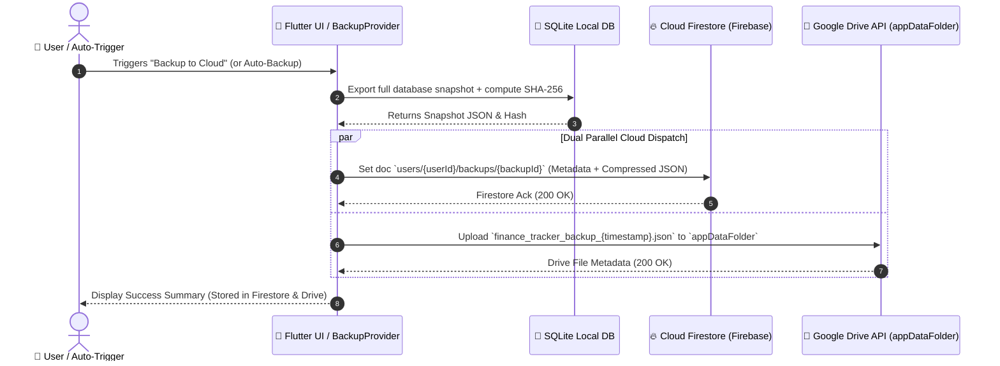

# SPEC 00005: Hybrid Cloud Backup Provider (Firebase Firestore and Google Drive)

## 1. Purpose

This specification defines the contract, schema, and architectural interfaces for the **Hybrid Dual-Destination Cloud Backup System** in the **Finance Tracker** Flutter application.

By orchestrating backup operations directly on-device across **Cloud Firestore** and **Google Drive AppData Folder**:
- Users achieve dual-redundancy backups with a single tap or automated trigger.
- **Firebase Firestore** serves as a lightweight, fast-querying cloud repository enabling near-instant cross-device restorations and status checks.
- **Google Drive** serves as an independent user-owned file storage layer keeping historical snapshot files in the user's private Google Drive `appDataFolder`.
- Preserves the strict **$0.00 zero-server-cost** operational boundary by leveraging free-tier Firebase Spark quotas and personal Google Drive storage without requiring paid Google Cloud Functions or intermediate backend servers.

---

## 2. Architecture & Workflow



---

## 3. Data Contracts & Interfaces

### 3.1 `CloudBackupDestination` Enum

```dart
enum CloudBackupDestination {
  firestore,
  googleDrive,
  all,
}
```

### 3.2 `CloudBackupInfo` DTO

```dart
class CloudBackupInfo {
  final String id;
  final String name;
  final CloudBackupDestination destination;
  final DateTime modifiedTime;
  final int sizeBytes;
  final String checksum;
  final int version;

  const CloudBackupInfo({
    required this.id,
    required this.name,
    required this.destination,
    required this.modifiedTime,
    required this.sizeBytes,
    required this.checksum,
    required this.version,
  });
}
```

### 3.3 `CloudBackupService` Contract

```dart
abstract class CloudBackupService {
  /// Uploads a snapshot to the designated cloud target (Firestore, Google Drive, or both).
  Future<List<CloudBackupInfo>> uploadBackup({
    required String backupJson,
    required String checksum,
    required CloudBackupDestination destination,
    String? userId,
  });

  /// Lists available cloud backups across configured providers.
  Future<List<CloudBackupInfo>> listBackups({
    CloudBackupDestination destination = CloudBackupDestination.all,
    String? userId,
  });

  /// Downloads raw JSON content for restoration from a specific cloud target.
  Future<String> downloadBackup({
    required String backupId,
    required CloudBackupDestination destination,
    String? userId,
  });

  /// Deletes a specific backup from its storage destination.
  Future<void> deleteBackup({
    required String backupId,
    required CloudBackupDestination destination,
    String? userId,
  });
}
```

---

### 3.4 Native File Export & Sharing Specification

To enable seamless user-facing reporting and external spreadsheet analysis (Excel, Google Sheets):
1. **CSV Ledger Export:**
   - Formatted compliant with RFC 4180.
   - Standard columns: `Date`, `Type`, `Amount`, `Currency`, `Merchant`, `Category`, `Account`, `Notes`.
   - File naming: `finance_tracker_transactions_YYYY-MM-DD.csv`.
2. **JSON Database Snapshot Export:**
   - Full structured database export with checksum header.
   - File naming: `finance_tracker_backup_YYYYMMDD_HHmmss.json`.
3. **OS Share Sheet Integration:**
   - Exports are written to app temporary storage (`path_provider`) and presented via the operating system's native Share Sheet (`share_plus` / file actions).
   - Enables direct sharing to WhatsApp, Email, Drive, local Downloads, or opening directly in spreadsheet viewer applications.

---

## 4. Cloud Storage Schema

### 4.1 Cloud Firestore Document Schema

Path: `users/{userId}/backups/{backupId}`

```json
{
  "id": "backup_20260913_153000",
  "name": "finance_tracker_backup_20260913_153000.json",
  "version": 1,
  "checksum": "e3b0c44298fc1c149afbf4c8996fb92427ae41e4649b934ca495991b7852b855",
  "sizeBytes": 14520,
  "createdAt": "2026-09-13T15:30:00Z",
  "deviceInfo": "Android 14 (SM-S918B)",
  "payload": {
    "accounts": [],
    "categories": [],
    "transactions": [],
    "subscriptions": [],
    "budgets": [],
    "savings_goals": []
  }
}
```

### 4.2 Google Drive AppData Structure

- Location: Google Drive private `appDataFolder` (hidden from Drive UI, isolated to app).
- Filename: `finance_tracker_backup_YYYYMMDD_HHmmss.json`.
- MIME Type: `application/json`.
- Metadata Properties: `appData: true`, `version: 1`, `checksum: sha256_hash`.

---

## 5. Invariants & Rules

1. **Zero External Backend Cost ($0.00):** Operations execute strictly client-side using direct Firebase SDK and Google Drive REST API calls. No billed Cloud Functions or cloud servers are required.
2. **Atomic Dual-Redundancy:** If one provider fails (e.g., Google Drive quota or network blip), the operation gracefully completes with the surviving provider and reports partial status to the user.
3. **SHA-256 Checksum Validation:** Every backup restored from either Firestore or Google Drive must pass cryptographic SHA-256 integrity verification against its payload prior to SQLite wiping and reinsertion.
4. **Local-First Precedence:** SQLite on the device remains the single source of truth. Cloud backups are immutable point-in-time recovery points.
5. **Unified Google Authentication:** Single OAuth sign-in grants both Drive access (`drive.appdata`) and Gmail access (`gmail.readonly`), while Firebase Auth seamlessly associates the authenticated Google User UID.

---

## 6. Verification Plan

### Automated Tests
- `FirestoreBackupServiceTest`: Unit test JSON document serialization, batch chunking, and restoration retrieval.
- `GoogleDriveBackupServiceTest`: Mock HTTP tests verifying upload and download streams.
- `BackupProviderTest`: Test dual-destination upload orchestration, fallback on single provider failure, and checksum validation.

### Manual & Integration Verification
- Create cloud backup and verify document existence in Firebase Console Firestore Database.
- Verify file presence in Google Drive `appDataFolder`.
- Wipe app local data and restore successfully from Firestore and Google Drive respectively.

