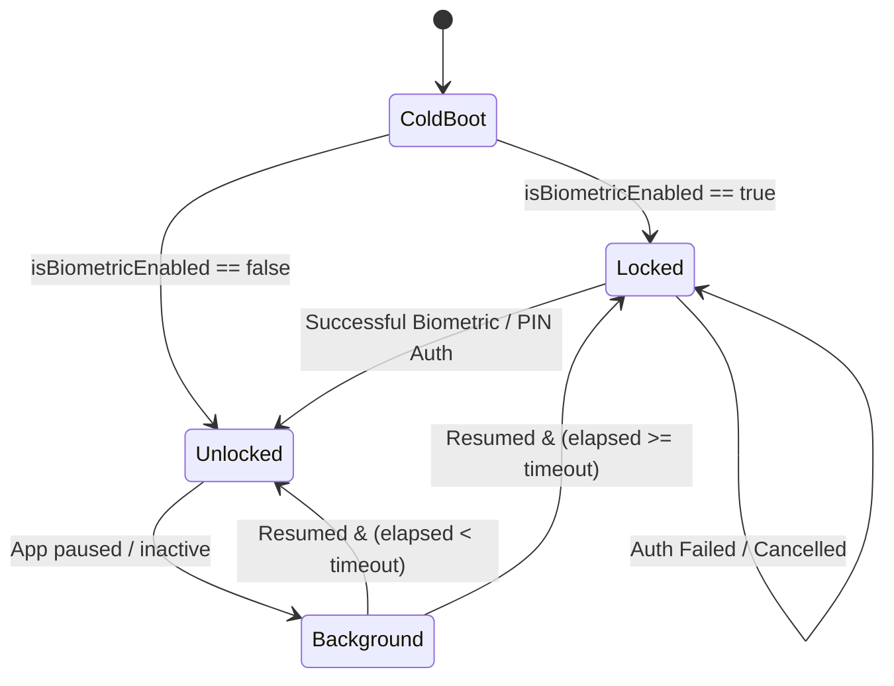

# SPEC 00007: Biometric Security and App Lock Authentication

## 1. Purpose

This specification defines the contract, service architecture, state management, and lifecycle triggers for **Biometric App Lock and Device Authentication** across Finance Tracker.

It guarantees that sensitive financial ledger balances, transactions, and account details remain protected against unauthorized physical access whenever the application is opened, resumed from the background, or left unattended.

---

## 2. Definition

### 2.1 Domain & Service Contracts

#### `BiometricAuthService`
```dart
abstract class BiometricAuthService {
  /// Checks whether hardware biometrics (Fingerprint/Face ID) or device credentials exist and are enrolled.
  Future<bool> isDeviceSupported();

  /// Checks if hardware sensors are capable and enrolled for biometrics.
  Future<bool> canCheckBiometrics();

  /// Returns list of available biometric sensor types on the device.
  Future<List<BiometricType>> getAvailableBiometrics();

  /// Prompts OS biometric challenge with fallback to device passcode/PIN.
  Future<bool> authenticate({
    required String localizedReason,
    bool biometricOnly = false,
  });
}
```

#### `AppLockProvider`
Manages reactive lock state, user preferences, and app lifecycle transitions:
* **`isAppLocked` (`bool`):** Set to `true` on cold boot or when background inactivity exceeds `lockTimeoutSeconds`.
* **`isBiometricEnabled` (`bool`):** User preference stored in `FlutterSecureStorage`.
* **`lockTimeoutSeconds` (`int`):** Inactivity threshold (0 = immediately, 30s, 60s, 300s). Default: `0` (immediate lock).
* **`authenticateAndUnlock()`:** Invokes `BiometricAuthService.authenticate()`. Upon success, sets `isAppLocked = false` and notifies listeners.

---

### 2.2 App Lifecycle & Auto-Lock State Machine



---

## 3. Invariants

1. **Explicit Verification Before Activation:** The user MUST successfully pass a biometric authentication challenge before `isBiometricEnabled` can be switched from `false` to `true` in Settings.
2. **Device Fallback Support:** If biometric recognition fails or the sensor is temporarily locked out, the prompt MUST allow fallback to device credentials (PIN, pattern, or OS passcode).
3. **Hardware Keystore Preference Storage:** The biometric configuration flag (`biometric_lock_enabled`) and auto-lock timeout MUST be stored in hardware-encrypted secure storage (`flutter_secure_storage`), preventing tampering via SQLite or file modification.
4. **Zero Financial Leakage During Lock:** When `isAppLocked` is `true`, the UI MUST render an impenetrable `AppLockScreen` overlay blocking all underlying views, inputs, routes, and data until authentication succeeds.
5. **Native Android Fragment Support:** `MainActivity.kt` MUST extend `FlutterFragmentActivity` to support Android BiometricPrompt APIs cleanly without runtime crashes.

---

## 4. Examples

### Settings Toggle Flow
```dart
Future<void> toggleBiometrics(bool enable) async {
  if (enable) {
    final authenticated = await _biometricService.authenticate(
      localizedReason: 'Scan your fingerprint or Face ID to enable App Lock.',
    );
    if (!authenticated) return;
  }
  await _secureStorage.write(key: 'biometric_lock_enabled', value: enable.toString());
  _isBiometricEnabled = enable;
  notifyListeners();
}
```

---

## 5. Open Questions

* None. The architecture leverages Flutter's official `local_auth` package with standard Android Keystore and biometric hardware bridges.

